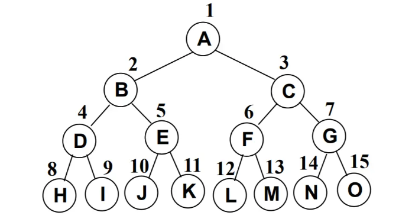

# 树

# 一、树的概念

## 1.结构

树是一种分层数据的抽象模型。现实生活中最常见的树的例子是家谱，或是公司的组织架构图，如下图所示


## 2.优点

我们之前已经学习了多种数据结构来保存数据, 为什么要使用树结构来保存数据呢?

- 树结构和数组/链表/哈希表的对比有什么优点呢?

数组:

- 优点:
  - 数组的主要优点是根据下标值访问效率会很高.
  - 但是如果我们希望根据元素来查找对应的位置呢?
  - 比较好的方式是先对数组进行排序, 再进行二分查找.
- 缺点:
  - 需要先对数组进行排序, 生成有序数组, 才能提高查找效率.
  - 另外数组在插入和删除数据时, 需要有大量的位移操作(插入到首位或者中间位置的时候), 效率很低.

链表:

- 优点:
  - 链表的插入和删除操作效率都很高.
- 缺点:
  - 查找效率很低, 需要从头开始依次访问链表中的每个数据项, 直到找到.
  - 而且即使插入和删除操作效率很高, 但是如果要插入和删除中间位置的数据, 还是需要重头先找到对应的数据.

哈希表:

- 优点:
  - 我们学过哈希表后, 已经发现了哈希表的插入/查询/删除效率都是非常高的
  - 但是哈希表也有很多缺点.
- 缺点:
  - 空间利用率不高, 底层使用的是数组, 并且某些单元是没有被利用的.
  - 哈希表中的元素是无序的, 不能按照固定的顺序来遍历哈希表中的元素.
  - 不能快速的找出哈希表中的最大值或者最小值这些特殊的值.

树结构:

- 我们不能说树结构比其他结构都要好, 因为每种数据结构都有自己特定的应用场景.
- 但是树确实也综合了上面的数据结构的优点(当然优点不足于盖过其他数据结构, 比如效率一般情况下没有哈希表高), 并且也弥补了上面数据结构的缺点.
- 而且为了模拟某些场景, 我们使用树结构会更加方便. 比如文件的目录结构.

## 3.树的术语

### 树的定义

- 树（Tree）: n（n≥0）个结点构成的有限集合。
  - 当n=0时，称为空树；
  - 对于任一棵非空树（n> 0），它具备以下性质：
  - 树中有一个称为“根（Root）”的特殊结点，用 r 表示；
  - 其余结点可分为m(m>0)个互不相交的有限集T1，T2，... ，Tm，其中每个集合本身又是一棵树，称为原来树的“子树（SubTree）”
- 注意:
  - 子树之间不可以相交
  - 除了根结点外，每个结点有且仅有一个父结点；
  - 一棵N个结点的树有N-1条边。

### 树的术语

- 结点的度（Degree）：结点的子树个数.
- 树的度：树的所有结点中最大的度数. (树的度通常为结点的个数N-1)
- 叶结点（Leaf）：度为0的结点. (也称为叶子结点)
- 父结点（Parent）：有子树的结点是其子树的根结点的父结点
- 子结点（Child）：若A结点是B结点的父结点，则称B结点是A结点的子结点；子结点也称孩子结点。
- 兄弟结点（Sibling）：具有同一父结点的各结点彼此是兄弟结点。
- 路径和路径长度：从结点n1到nk的路径为一个结点序列n1 , n2,… , nk, ni是 ni+1的父结点。路径所包含边的个数为路径的长度。
- 结点的层次（Level）：规定根结点在1层，其它任一结点的层数是其父结点的层数加1。
- 树的深度（Depth）：树中所有结点中的最大层次是这棵树的深度。

## 4.树的表示

- 树可以有多种表示的方式.
- 最普通的表示方式:


+ 儿子-兄弟表示法


+ 儿子-兄弟表示法旋转


- 你发现上面规律了吗?
  - 其实所有的树本质上都可以使用二叉树模拟出来.
  - 所以在学习树的过程中, 二叉树非常重要.

# 二、二叉树

## 1.定义

二叉树的定义

- 二叉树可以为空, 也就是没有结点.
- 若不为空，则它是由根结点和称为其左子树TL和右子树TR的两个不相交的二叉树组成。

二叉树有五种形态:

- 注意c和d是不同的二叉树, 因为二叉树是有左右之分的.


## 2.二叉树的特性

二叉树有几个比较重要的特性, 在笔试题中比较常见:

- 一个二叉树第 i 层的最大结点数为：2^(i-1), i >= 1;

```
在二叉树中，第 i 层的最大节点数可以通过数学方式推导出来。假设树的根节点在第 1 层。二叉树的节点数通常由树的高度（最大深度）决定。

对于第 i 层的最大节点数，可以使用以下公式计算：

最大节点数 = 2^(i-1)

这是因为在二叉树中，每向下移动一层，节点数会以指数方式增加。第一层有 1 个节点（2^0 = 1），第二层有 2 个节点（2^1 = 2），第三层有 4 个节点（2^2 = 4），以此类推。所以，第 i 层的最大节点数可以通过这个公式得出。
```

- 深度为k的二叉树有最大结点总数为： 2^k - 1, k >= 1;

```
在深度为 k 的二叉树中，节点数的计算方法是通过每一层的节点数相加得到的。每一层最大节点数是 2 的层数次方。所以，深度为 k 的二叉树的最大节点总数可以用下面的公式计算：

最大节点数 = 2^0 + 2^1 + 2^2 + ... + 2^(k-1)

这是一个等比数列求和问题。使用等比数列求和公式，可以得到：

最大节点数 = 2^k - 1

这意味着深度为 k 的二叉树的最大节点总数是 2^k - 1
```

- 对任何非空二叉树 T，若n0表示叶结点的个数、n2是度为2的非叶结点个数，那么两者满足关系n0 = n2 + 1。


```
n(0) = n(2) +1
n(0) 表示度为0的结点， n(1) 表示度为1的结点，n(2) 表示度为2的结点

假设该二叉树总共有n个结点(n=n0+n1+n2)，则该二叉树总共会有n-1条边

度为2的结点会延伸出两条边，同理，度为1的结点会延伸出一条边，则可列公式：n-1 = 2 * n(2) + 1*n(1) ，

合并两个式子可得：2 * n(2) + 1*n(1) + 1 =n(0) + n(1) + n(2) ，则计算可知 n(0)=n(2)+1。
```


## 3.特殊二叉树

### 满二叉树

完美二叉树(Perfect Binary Tree) , 也称为满二叉树(Full Binary Tree）

- 在二叉树中, 除了最下一层的叶结点外, 每层节点都有2个子结点, 就构成了满二叉树.



### 完全二叉树

- 除二叉树最后一层外, 其他各层的节点数都达到最大个数.
- 且最后一层从左向右的叶结点连续存在, 只缺右侧若干节点.
- 满二叉树是特殊的完全二叉树.


## 4.二叉树的存储

### 数组

- 二叉树的存储常见的方式是数组和链表.

  使用数组存储:

  - 完全二叉树: 按从上至下、从左到右顺序存储

  - 非完全二叉树:

    - 非完全二叉树要转成完全二叉树才可以按照上面的方案存储.

    - 但是会造成很大的空间浪费


### 链表

链表存储:

- 二叉树最常见的方式还是使用链表存储.
- 每个结点封装成一个Node, Node中包含存储的数据, 左结点的引用, 右结点的引用.


