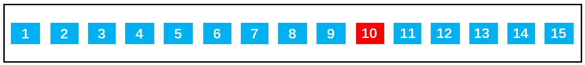

# 02二叉树的概览&基本操作

# 一、概念

二叉搜索树（BST，Binary Search Tree），也称为二叉排序树和二叉查找树。

二叉搜索树是一棵二叉树，可以为空。

树是用来模拟具有树状结构性质的数据集合。根据它的特性可以分为非常多的种类，对于我们来讲，掌握二叉树这种结构就足够了，它也是树最简单、应用最广泛的种类。

> 二叉树是一种典型的树树状结构。如它名字所描述的那样，二叉树是每个节点最多有两个子树的树结构，通常子树被称作“左子树”和“右子树”。

# 二、特性

如果不为空，则满足以下**性质**：

- 条件 1：非空左子树的所有键值小于其根节点的键值。比如三中节点 6 的所有非空左子树的键值都小于 6；
- 条件 2：非空右子树的所有键值大于其根节点的键值；比如三中节点 6 的所有非空右子树的键值都大于 6；
- 条件 3：左、右子树本身也都是二叉搜索树；

如上图所示，树二和树三符合 3 个条件属于二叉树，树一不满足条件 3 所以不是二叉树。

总结：二叉搜索树的特点主要是相对较小的值总是保存在左节点上，相对较大的值总是保存在右节点上。这种特点使得二叉搜索树的查找效率非常高，这也就是二叉搜索树中“搜索”的来源。

# 三、应用

下面是一个二叉搜索树：

若想在其中查找数据 10，只需要查找 4 次，查找效率非常高。

- 第 1 次：将 10 与根节点 9 进行比较，由于 10 > 9，所以 10 下一步与根节点 9 的右子节点 13 比较；
- 第 2 次：由于 10 < 13，所以 10 下一步与父节点 13 的左子节点 11 比较；
- 第 3 次：由于 10 < 11，所以 10 下一步与父节点 11 的左子节点 10 比较；
- 第 4 次：由于 10 = 10，最终查找到数据 10 。

同样是 15 个数据，在排序好的数组中查询数据 10，需要查询 10 次：

其实：如果是排序好的数组，可以通过二分查找：第一次找 9，第二次找 13，第三次找 11...。我们发现如果把每次二分的数据拿出来以树的形式表示的话就是二叉搜索树。这就是数组二分法查找效率之所以高的原因。