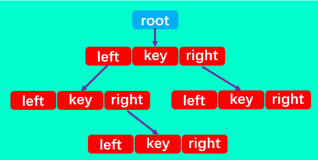

# 03二叉树的封装

# 一、定义节点结构

二叉搜索树有四个最基本的属性：指向节点的根（root），节点中的数据（data）、左指针（left）、右指针（right）。



所以，二叉搜索树中除了定义 root 属性外，还应定义一个节点内部类，里面包含每个节点中的 left、right 和 data 三个属性。

```js
// 定义节点结构
class Node {
  constructor(data) {
    // 节点值
    this.data = data;
    // 左子树
    this.left = null;
    // 右子树
    this.right = null;
  }
}
```

# 二、二叉搜索树的常见操作

+ `createBst`创建二叉树

- `insert(key)` 向树中插入一个新的键。
- `search(key)` 在树中查找一个键，如果节点存在，则返回 true；如果不存在，则返回 `false`。
- `preOrderTraverse` 通过先序遍历方式遍历所有节点。
- `inOrderTraverse` 通过中序遍历方式遍历所有节点。
- `postOrderTraverse` 通过后序遍历方式遍历所有节点。
- `min` 返回树中最小的值/键。
- `max` 返回树中最大的值/键。
- `remove(key)` 从树中移除某个键。


# 三、二叉树的创建


